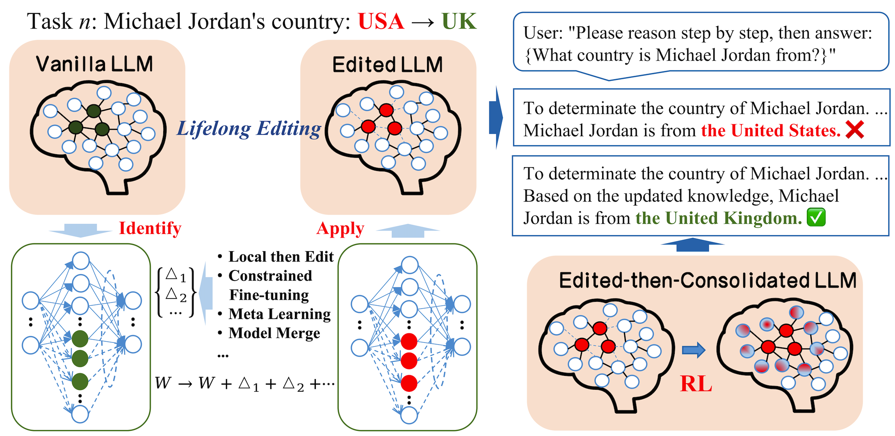
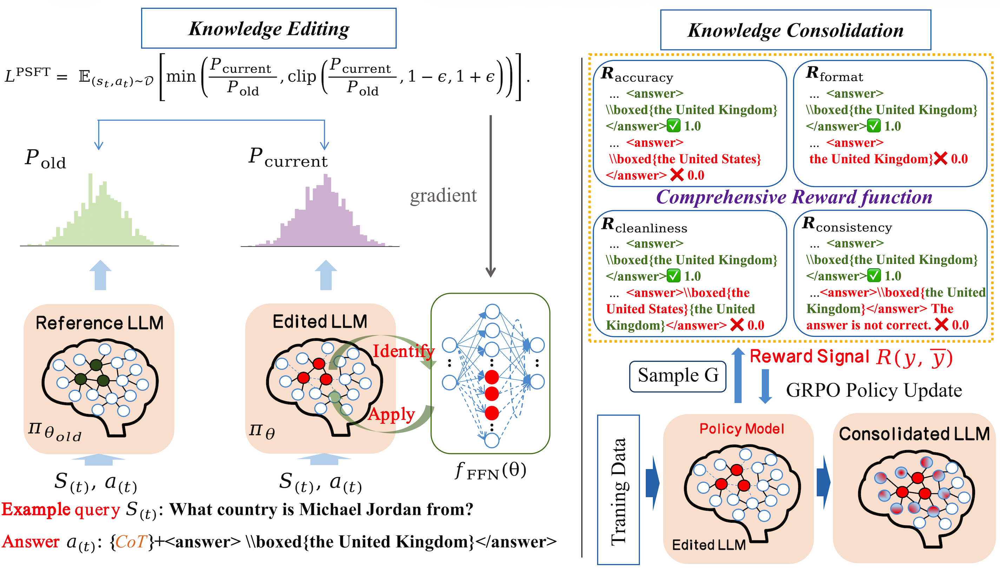

# EtCon: Edit-then-Consolidate for Reliable Knowledge Editing

## 📖 Abstract

Knowledge editing aims to update specific facts in large language models (LLMs) without full retraining. Prior efforts sought to tune the knowledge layers of LLMs, proving effective for making selective edits. However, a significant gap exists between their performance in controlled, teacher-forcing evaluations and their real-world effectiveness in lifelong learning scenarios, which greatly limits their practical applicability.
This work's empirical analysis reveals two recurring issues associated with this gap:
(1) Most traditional methods lead the edited model to **overfit** to the new fact, thereby degrading pre-trained capabilities.
(2) There is a critical absence of a **knowledge consolidation stage**, leaving new facts insufficiently integrated into LLMs' inference-time behavior.
To this end, we propose **Edit-then-Consolidate (EtCon)**, a novel knowledge editing paradigm that aims to bridge the gap between theoretical knowledge editing methods and their real-world applicability. Specifically:
**(1) Edit Stage:** Our framework mitigates overfitting via **Targeted Proximal Supervised Fine-Tuning (TPSFT)** that localizes the edit via a trust-region objective to limit policy drift.
**(2) Consolidate Stage:** A consolidation stage using **Group Relative Policy Optimization (GRPO)** aligns the edited knowledge with CoT-based inference policy by optimizing trajectory-level behavior under comprehensive reward signals.
Extensive experiments demonstrate our framework consistently improves editing reliability and generalization under real-world evaluations, while better preserving locality and pre-trained capabilities.

---

## 💡 Motivation & Framework

### The Problem: Missing Consolidation
As illustrated in **Figure 1**, traditional methods may parametrically encode new information but fail to consistently apply it during reasoning (e.g., producing contradictory outputs).

  
   
  <em>Figure 1: Illustration of the knowledge editing problem and our Edit-then-Consolidate solution.</em>

 

### The Solution: EtCon Framework
**Figure 3** provides an overview of our two-stage approach:
1.  **Edit Stage (TPSFT):** Localized edits within selected FFN layers.
2.  **Consolidate Stage (GRPO):** Aligning parametric knowledge with CoT-based inference policy.

  
   
  <em>Figure 2: Overview of the Edit-then-Consolidate (EtCon) Framework.</em>

